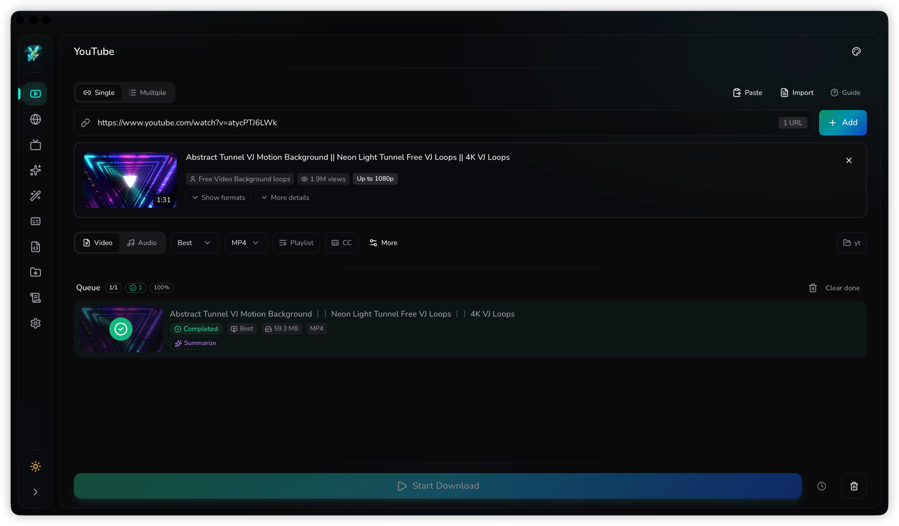
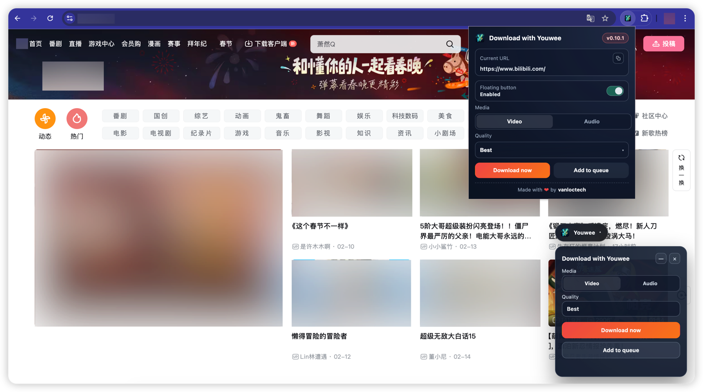

# Youwee

<div align="center">

  [](../README.md)
  [](README.vi.md)
  [](README.zh-CN.md)
  [](README.fr.md)
  [](README.ru.md)
  [](https://github.com/vanloctech/youwee/discussions/18)

  
  
  **Un téléchargeur vidéo YouTube moderne et élégant, construit avec Tauri et React**

  [](https://github.com/vanloctech/youwee/releases)
  [](https://opensource.org/licenses/MIT)
  [](https://www.reddit.com/r/youwee)
  [](https://tauri.app/)
  [](https://react.dev/)
</div>

---

## Fonctionnalités

- **Téléchargement vidéo** — YouTube, TikTok, Facebook, Instagram, Bilibili, Youku, et plus de 1800 sites
- **Pont via extension navigateur** — Extension Chromium + Firefox avec bouton flottant, choix média/qualité, envoi en un clic `Download now` / `Add to queue` vers Youwee
- **Suivi de chaînes** — Suivez des chaînes YouTube, Bilibili et Youku, recevez des notifications de nouvelles vidéos, activez le téléchargement automatique, et gérez depuis la barre système
- **Récupération de métadonnées** — Téléchargez les informations vidéo, descriptions, commentaires et miniatures sans télécharger la vidéo
- **Prise en charge du live** — Téléchargez les live streams avec un interrupteur dédié
- **Résumé vidéo par IA** — Résumez des vidéos avec Gemini, OpenAI ou Ollama
- **Traitement vidéo par IA** — Modifiez des vidéos en langage naturel (couper, convertir, redimensionner, extraire l'audio)
- **Téléchargement par plage temporelle (coupe)** — Téléchargez uniquement le segment voulu en définissant l'heure de début/fin
- **Lot & playlist** — Téléchargez plusieurs vidéos ou des playlists complètes
- **Extraction audio** — Extrayez l'audio en MP3, M4A ou Opus
- **Support des sous-titres** — Téléchargez ou intégrez les sous-titres
- **Atelier de sous-titres** — Créez, modifiez et améliorez des sous-titres (SRT/VTT/ASS) avec outils de timing, rechercher/remplacer, auto-correction, traduction IA, correction grammaticale IA, et génération Whisper
- **Fonctions clés de la page sous-titres** — Timeline forme d'onde/spectrogramme, synchronisation par changement de plan, contrôle qualité en temps réel via profils de style, outils de fusion/scission, mode traducteur (source/cible), opérations batch/projet
- **Post-traitement** — Intègre automatiquement les métadonnées, miniature et sous-titres (si activé) dans le fichier de sortie
- **SponsorBlock** — Ignore automatiquement sponsors, intros, outros et auto-promotions avec modes suppression/marquage/personnalisé
- **Limitation de vitesse** — Contrôlez la bande passante de téléchargement (KB/s, MB/s, GB/s)
- **Bibliothèque de téléchargements** — Suivez et gérez tous vos téléchargements
- **6 thèmes élégants** — Midnight, Aurora, Sunset, Ocean, Forest, Candy
- **Rapide et léger** — Construit avec Tauri pour une consommation minimale de ressources

## Captures d'écran



<details>
<summary><strong>Plus de captures</strong></summary>




</details>

## Vidéo de démonstration

▶️ [Regarder sur YouTube](https://www.youtube.com/watch?v=H7TtVZWxilU)

## Installation

### Télécharger pour votre plateforme

> ⚠️ **Note** : L'application n'est pas encore signée avec un certificat Apple Developer. Si macOS bloque l'application, ouvrez le terminal et lancez :
> ```bash
> xattr -cr /Applications/Youwee.app
> ```

| Plateforme | Téléchargement |
|----------|----------------|
| **Windows** (x64) | [Télécharger .msi](https://github.com/vanloctech/youwee/releases/latest/download/Youwee-Windows.msi) · [Télécharger .exe](https://github.com/vanloctech/youwee/releases/latest/download/Youwee-Windows-Setup.exe) |
| **macOS** (Apple Silicon) | [Télécharger .dmg](https://github.com/vanloctech/youwee/releases/latest/download/Youwee-Mac-Apple-Silicon.dmg) |
| **macOS** (Intel) | [Télécharger .dmg](https://github.com/vanloctech/youwee/releases/latest/download/Youwee-Mac-Intel.dmg) |
| **Linux** (x64) | [Télécharger .deb](https://github.com/vanloctech/youwee/releases/latest/download/Youwee-Linux.deb) · [Télécharger .AppImage](https://github.com/vanloctech/youwee/releases/latest/download/Youwee-Linux.AppImage) (recommandé pour les mises à jour auto) |

> Voir toutes les versions sur la page [Releases](https://github.com/vanloctech/youwee/releases)

### Extension navigateur (Chromium + Firefox)

| Navigateur | Téléchargement |
|---------|----------------|
| **Chromium** (Chrome/Edge/Brave/Opera/Vivaldi/Arc/Coc Coc) | [Télécharger .zip](https://github.com/vanloctech/youwee/releases/latest/download/Youwee-Extension-Chromium.zip) |
| **Firefox** | [Télécharger .xpi](https://github.com/vanloctech/youwee/releases/latest/download/Youwee-Extension-Firefox-signed.xpi) |

- Envoi en un clic de l'onglet actuel vers Youwee avec `Download now` ou `Add to queue`
- Le bouton flottant prend en charge la sélection `Video/Audio` + qualité sur les sites compatibles
- Le popup fonctionne sur tous les onglets HTTP/HTTPS valides
- Guide : [docs/browser-extension.md](browser-extension.md)

### Construire depuis le code source

#### Prérequis

- [Bun](https://bun.sh/) (v1.3.5 ou plus récent)
- [Rust](https://www.rust-lang.org/) (v1.70 ou plus récent)
- [Tauri CLI](https://tauri.app/v1/guides/getting-started/prerequisites)

#### Étapes

```bash
# Cloner le dépôt
git clone https://github.com/vanloctech/youwee.git
cd youwee

# Installer les dépendances
bun install

# Lancer en mode développement
bun run tauri dev

# Build pour la production
bun run tauri build
```

## Stack technique

- **Frontend** : React 19, TypeScript, Tailwind CSS, shadcn/ui
- **Backend** : Rust, Tauri 2.0
- **Téléchargeur** : yt-dlp (embarqué)
- **Build** : Bun, Vite

## Contribuer

Les contributions sont les bienvenues. Voir le [guide de contribution](../CONTRIBUTING.md).

## Licence

Ce projet est sous licence MIT - voir le fichier [LICENSE](../LICENSE).

## Remerciements

- [yt-dlp](https://github.com/yt-dlp/yt-dlp) - Le puissant téléchargeur vidéo
- [FFmpeg](https://ffmpeg.org/) - Framework multimédia pour le traitement audio/vidéo
- [Deno](https://deno.com/) - Runtime JavaScript pour l'extraction YouTube
- [Tauri](https://tauri.app/) - Construisez des applications desktop plus petites, plus rapides et plus sécurisées
- [shadcn/ui](https://ui.shadcn.com/) - Beaux composants UI
- [Lucide Icons](https://lucide.dev/) - Superbes icônes open source

## Contact

- **GitHub** : [@vanloctech](https://github.com/vanloctech)
- **Issues** : [GitHub Issues](https://github.com/vanloctech/youwee/issues)

---

## Star History

<picture>
  <source
    media="(prefers-color-scheme: dark)"
    srcset="
      https://api.star-history.com/svg?repos=vanloctech/youwee&type=Date&theme=dark
    "
  />
  <source
    media="(prefers-color-scheme: light)"
    srcset="
      https://api.star-history.com/svg?repos=vanloctech/youwee&type=Date
    "
  />
  
</picture>

<div align="center">
  Made with ❤️ by VietNam
</div>
